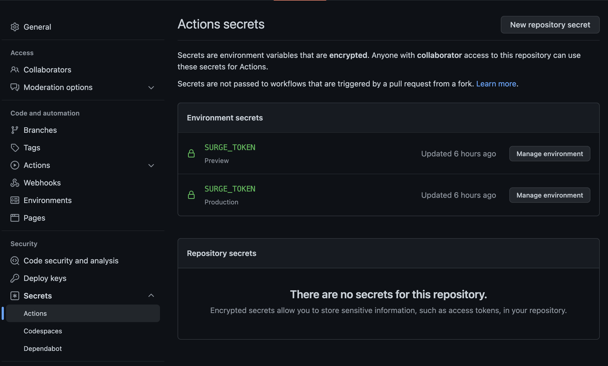

# React App

This is a template for a [Create React App](https://create-react-app.dev/) with additional tools.

<!-- toc -->

- [Tech-Stack](#tech-stack)
- [Getting started](#getting-started)
- [Behavior Driven Development](#behavior-driven-development)
- [Test Driven Development](#test-driven-development)
- [Commitlint](#commitlint)
- [Commands](#commands)
- [Skipping linters](#skipping-linters)

<!-- tocstop -->

It uses the following tools/libraries:

## Tech-Stack
* [Storybook](https://storybook.js.org/)
* [Cypress](https://cypress.io/)
* [Jest](https://jestjs.io/)
* [Commitlint](https://commitlint.js.org/)
* [Stylelint](https://stylelint.io/)
* [Eslint](https://eslint.org/)
* [Prettier](https://prettier.io/)

## Project Setup

This project uses different deployments to make code reviews easier:

* Vercel (App Production)
* Vercel (App Preview)
* GitHub Pages (Storybook Production)
* Surge (Storybook Preview)

### Set up Vercel

Please follow this guide: https://vercel.com/docs/concepts/git

### Setup GitHub Pages

Please follow this guide: https://docs.github.com/en/pages/getting-started-with-github-pages/configuring-a-publishing-source-for-your-github-pages-site

Use the `gh-pages` branch

### Setup Surge

To generate a surge token please use the following command

```shell
npx surge token
```

It will output something like this:

```shell
❯ npx surge token

   1234567890abcdefghijklmnopqrstuv
```

Add this token to your [GitHub secrets](https://docs.github.com/en/actions/security-guides/encrypted-secrets) 

We only need it for the "Preview" Environment, but you can add it to both (see screenshot below)



## Getting started

**Run the development server:**

```bash
npm run dev
```

**Run storybook:**

```shell
npm run storybook
```

## Behavior Driven Development

We use behavior tests. You can read more about our decision in the
[documentation](./docs/BEHAVIOR_DRIVEN_DEVELOPMENT.md).

## Test Driven Development

We jest to write unit tests. Please look at the Documentation for [Jest](https://jestjs.io/)
and [testing-library](https://testing-library.com/docs/react-testing-library/intro/).

## Commitlint

We use commitlint to ensure conventional commit messages. You can read more about our decision in
the [documentation](./docs/COMMITS.md).


## Commands

**Run the development server:**

```bash
npm run dev
```

**Build:**

```shell
npm run build
```

**Run storybook:**

```shell
npm run storybook
```

**Build storybook:**

```shell
npm run storybook:build
```

**Run e2e tests:**

```shell
npm run cypress # local without server
# npm run cypress:run # headless
# npm run test:e2e # with server
```

**Run unit tests:**

```shell
npm run jest
# npm run jest:watch # watch
# npm run test:unit # same as "npm run jest"
```

**Run all tests:**

```shell
npm run test
```

**Run stylelint**

```shell
npm run stylelint
```

**Run eslint**

```shell
npm run eslint
```

**Run all linters**

```shell
npm run lint
```

## Skipping linters

If you need to skip a linter you can add the `--no-verify` flag.

> Warning! We strongly advise against skipping linters.

```shell
# Skipping commitlint
git commit README.md -m "this is a dirty commit" --no-verify
# Skipping linters
git push --no-verify
```
